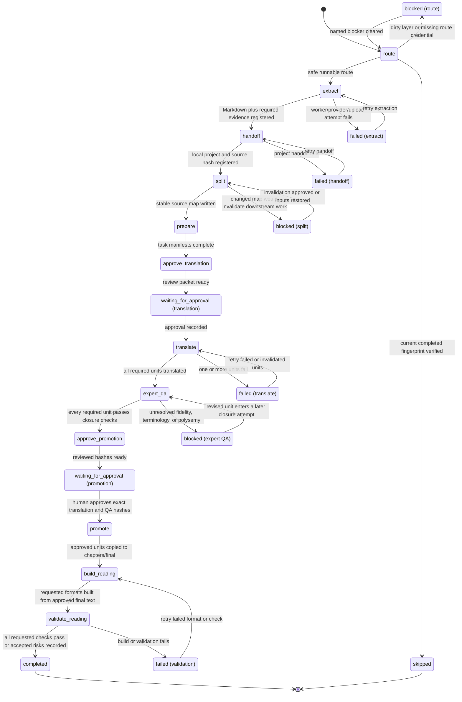

# Unified pipeline job model prototype

Status: planning prototype; not a production schema or migration.

This artifact answers one question: what is the smallest persistent job model that lets the existing launcher represent a Zotero collection from discovery through per-attachment extraction, staged-gates translation, expert QA, and approved `output/reading` artifacts without hiding retries, approvals, provenance, or privacy boundaries?

All examples are fabricated. This prototype does not authorize or perform real OCR, Zotero writes, provider calls, translation, cleanup, or source deletion.

## Decision

Use one collection parent job as an aggregate and one durable child job per PDF attachment as the execution unit. The parent owns selection, discovery evidence, child membership, and aggregate status; it never runs an opaque collection-wide OCR/provider command. Each child owns its Zotero/source identity, ordered stages, approvals, retry scope, local reading project, and artifacts. Chapter translation and QA are units within the child stages, not new top-level jobs.

The launcher talks to one deep runner module through five actions:

```text
create(selection, intent) -> job
advance(job_id, optional child_id) -> job
approve(job_id, child_id, gate_id, approval_evidence) -> job
retry(job_id, child_id, optional stage_id, optional unit_ids) -> job
open(job_id, optional child_id) -> safe local target
```

The runner owns stage ordering, state persistence, status aggregation, artifact registration, hash validation, approval invalidation, idempotency, redaction, and selection of safe open targets. OCR and translation providers remain internal adapters at existing seams. The launcher UI does not learn MinerU payloads, Zotero upload details, or provider credentials.

## Grounding in the current launcher

| Current launcher fact | Prototype treatment |
| --- | --- |
| `BookPipelineJob` persists source, route, status, artifacts, attempts, and optional collection items in local JSON. | Preserve those concepts, version the document, and make parent/child/stage relationships explicit. A future storage migration must not change the runner interface. |
| Collection execution already loops over route items and retries failed items only. | Promote each route item to a durable attachment child. Retry remains child-scoped and becomes stage- or chapter-scoped after handoff. |
| `translation_ready` currently means a local project skeleton exists. | Record handoff as a completed stage. It is not a terminal job success when translation or reading outputs were requested. |
| Stages currently collapse into top-level strings such as `handoff_running`. | Give every stage its own status. The parent and child top-level status are derived summaries. |
| Artifacts currently have `kind`, `path`, optional SHA-256, and optional Zotero key. | Preserve them and add producer stage, input hashes, size, source refs, privacy class, validation, and retention semantics. |
| `open output` opens the output directory or the nearest existing ancestor. | Persist an allowlisted open target and never walk above an approved job/project root. Blocked, partial, failed, and completed states each have deterministic behavior. |

## Ownership and hierarchy

```text
collection job
├── discovery stage
├── attachment child A
│   ├── route/extract/handoff stages
│   ├── split/prepare stages
│   ├── translation approval gate
│   ├── translate units (one per chapter or stable source block)
│   ├── expert-QA units
│   ├── promotion approval gate
│   └── promote/build/validate stages
└── attachment child B
    └── same ordered stage contract, with independent route and retry state
```

For a single Zotero attachment or selected Markdown source, the same model is used with a parent containing one child. This avoids a second runner contract.

### Parent responsibilities

- Store the selection intent: source kind, canonical `collectionKey`, requested mode, target language, and output formats.
- Run collection discovery through `zotero_llm_worker.py --collection-key <collectionKey>` and persist the redacted discovery evidence.
- Freeze the attachment membership for this run. A later collection refresh creates a new revision or explicit reconciliation action; it does not silently mutate a running job.
- Aggregate child states and expose counts without copying child errors or artifacts into a second source of truth.
- Retry only eligible children. Never call OCR, MinerU, or translation providers directly.

### Attachment child responsibilities

- Store canonical Zotero/source identity and the selected extraction route.
- Execute the decided per-attachment worker command with `--attachment-key` and the selected force flag.
- Own the local reading project and all post-handoff stages.
- Register artifacts and approvals against exact input hashes.
- Retry the smallest safe boundary and invalidate downstream state when inputs change.

### Chapter units

Translation and expert QA stages contain unit records keyed by stable chapter/source-map IDs. This is the only nested execution level below an attachment. A chapter unit may fail and retry independently, while the stage remains `running`, `failed`, or `blocked` until its required units close.

## Status vocabulary

Stage status uses the exact staged-gates vocabulary:

| Status | Meaning | Actionable transition |
| --- | --- | --- |
| `pending` | Ordered but prerequisites are incomplete. | Runner promotes it when prerequisites close. |
| `ready` | Prerequisites and required configuration are satisfied. | `advance` or a scheduler may start it. |
| `running` | One attempt currently owns execution. | Completion, failure, or an explicit safe interruption ends the attempt. |
| `waiting_for_approval` | A human gate has a complete review packet. | Only `approve` or explicit rejection changes it. Retry does not bypass it. |
| `blocked` | Cannot proceed until a named non-execution condition changes. | Re-evaluate after credentials, source review, or prerequisite evidence changes. |
| `failed` | An attempt ended unsuccessfully and retained evidence. | `retry` starts a new attempt at the eligible boundary. |
| `completed` | Required outputs and validation for this stage match recorded inputs. | Reused while hashes and contract version remain unchanged. |
| `skipped` | Explicitly not required for this job or already satisfied by verified external evidence. | Terminal unless job intent changes. |

Top-level parent and child status use the same vocabulary plus one aggregate-only value:

- `partial`: no work is currently running or awaiting immediate approval, and terminal child outcomes are mixed (for example, one completed and one failed/blocked). It never hides the per-child state.

Legacy compatibility is one-way on load: `routed -> ready`; `handoff_running -> running` on the handoff stage; `translation_ready -> completed` on handoff plus `ready`/`waiting_for_approval` on the next requested stage. New writes do not emit legacy status names.

### Aggregate precedence

Parent status is derived, never manually set:

1. `running` if discovery or any child is running.
2. `waiting_for_approval` if no work is running and any child waits at a human gate.
3. `ready` if no higher-priority state exists and any child can advance.
4. `completed` if discovery completed and every requested child is `completed` or intentionally `skipped`, with at least one completed child.
5. `partial` if terminal outcomes are mixed and at least one child completed or skipped.
6. `failed` if all non-skipped children failed.
7. `blocked` if all remaining children are blocked and none completed.
8. `pending` before discovery can run.

## Mermaid state diagrams

### Collection parent

```mermaid
stateDiagram-v2
    state "running (discovery)" as discovering
    state "running (children)" as running_children
    [*] --> pending
    pending --> ready: selection validated
    pending --> blocked: invalid selector or unavailable Zotero
    ready --> discovering: discover collection
    discovering --> failed: discovery attempt fails
    failed --> ready: retry discovery
    discovering --> running_children: membership frozen
    running_children --> running_children: child completes; others runnable
    running_children --> waiting_for_approval: no child running; a gate is waiting
    waiting_for_approval --> running_children: scoped approval recorded
    running_children --> ready: runnable child remains
    running_children --> partial: terminal outcomes mixed
    running_children --> failed: every required child failed
    running_children --> blocked: every remaining child blocked
    running_children --> completed: all required children completed or skipped
    partial --> running_children: retry eligible child
    failed --> running_children: retry eligible child
    blocked --> running_children: named blocker cleared
    completed --> [*]
```



### Per-attachment child



`waiting_for_approval` appears at two gates. The persisted `currentStageId` and gate ID distinguish translation disclosure from final promotion.

## Ordered runner contract

| Order | Stage ID | Scope | Owner and output | Retry boundary |
| --- | --- | --- | --- | --- |
| 0 | `discover` | Parent | Worker enumerates the real `collectionKey`, expands parent items to PDF attachment children, and freezes membership. | Whole discovery attempt; no provider calls or uploads. |
| 1 | `route` | Child | Reuse worker route evidence to select `direct_text`, `remote_paddleocr`, `mineru`, block dirty text, or verify already completed. | Re-evaluate one child. |
| 2 | `extract` | Child | Run `zotero_llm_worker.py --attachment-key` with `--force-text`, `--force-ocr`, or decided `--force-mineru`; register Markdown, sidecars, hashes, and optional Markdown attachment key. | One attachment. Existing matching StateDB/Zotero evidence may make it idempotently complete. |
| 3 | `handoff` | Child | Create/reuse one local reading project and register `source/source.md` plus `metadata/source_manifest.json`. | One attachment/project keyed by child ID plus source Markdown hash. |
| 4 | `split` | Child | Deterministically write `chapters/src/` and a source map with chapter/block traceability. | Whole item. Changed map requires explicit invalidation approval if downstream work exists. |
| 5 | `prepare` | Child | Seed glossary/style, chapter controls, and provider-independent task manifests. | Whole item, or regenerate only manifests whose referenced hashes changed. |
| 6 | `approve_translation` | Child gate | Review packet binds provider profile ID, non-secret config ID, task scope, task/source hashes, and timestamp. | No automatic retry. Any bound hash/config/scope change invalidates approval. |
| 7 | `translate` | Chapter units | Internal provider adapter writes `chapters/translated/` with source-to-target traceability. | Failed/invalidated chapter units only; unchanged completed units are reused. |
| 8 | `expert_qa` | Chapter units | Target-only, fidelity, polysemy, prose rebuild, and closure evidence in chapter controls. | Failed/invalidated units only. A fix attempt cannot be the PASS attempt. |
| 9 | `approve_promotion` | Child gate | Review packet binds exact translation artifacts and PASS control hashes. Failed or unresolved units are excluded. | No automatic retry. Any translation/control hash change invalidates approval. |
| 10 | `promote` | Child | Copy only approved units to `chapters/final/` and register promotion evidence. | Approved units whose bound hashes remain current. |
| 11 | `build_reading` | Child | Build requested Markdown/semantic HTML and optional reflowable print-compatible EPUB only from `chapters/final/`. | Per requested format. |
| 12 | `validate_reading` | Child | Check required artifacts; run relevant HTML/layout checks and EPUBCheck when EPUB exists; record accepted residual risks in `qa/status.md`. | Per failed format/check. |

Stages 6 and 9 are always human gates for real runs. A fake provider can be pre-approved only inside automated fixtures marked `executionMode: fake`; that fixture behavior must not migrate into real jobs.

## Representative JSON job

This document is intentionally verbose enough to expose the data decisions. It represents a fabricated two-item collection in which one child has completed and one waits for translation-provider approval.

```json
{
  "schemaVersion": "book-pipeline-job-v2-prototype",
  "jobId": "job_fake_collection_20260710_001",
  "kind": "collection",
  "status": "waiting_for_approval",
  "currentStageId": "children",
  "intent": {
    "mode": "convert_then_translate",
    "targetLanguage": "zh-Hans",
    "outputFormats": ["markdown", "html"],
    "digestMode": false,
    "executionMode": "fake"
  },
  "source": {
    "kind": "zotero_collection",
    "collectionKey": "FAKECOL1",
    "displayLabel": "[private collection]",
    "recursive": false
  },
  "membership": {
    "revision": 1,
    "frozenAt": "2026-07-10T09:00:00+08:00",
    "discoveryStageId": "discover",
    "childJobIds": ["child_FAKEPDF1", "child_FAKEPDF2"]
  },
  "summary": {
    "total": 2,
    "pending": 0,
    "ready": 0,
    "running": 0,
    "waitingForApproval": 1,
    "blocked": 0,
    "failed": 0,
    "completed": 1,
    "skipped": 0
  },
  "stages": [
    {
      "stageId": "discover",
      "status": "completed",
      "attempt": 1,
      "startedAt": "2026-07-10T09:00:00+08:00",
      "finishedAt": "2026-07-10T09:00:02+08:00",
      "inputHashes": {},
      "artifactIds": ["artifact_discovery_manifest"],
      "error": null
    }
  ],
  "children": [
    {
      "jobId": "child_FAKEPDF1",
      "kind": "attachment",
      "parentJobId": "job_fake_collection_20260710_001",
      "status": "completed",
      "currentStageId": "validate_reading",
      "source": {
        "collectionKey": "FAKECOL1",
        "parentItemKey": "FAKEPAR1",
        "pdfAttachmentKey": "FAKEPDF1",
        "sourcePdfMd5": "11111111111111111111111111111111",
        "sourcePdfSha256": "ea2cc27a9e627cf2cab40aa9898e2983b4c949695c48f76eb0282b812b40a7fa",
        "route": "mineru-open-api",
        "markdownAttachmentKey": "FAKEMD01"
      },
      "localProject": {
        "projectId": "project_child_FAKEPDF1",
        "root": "<LOCAL_READING_ROOT>/books/local/zh-Hans/001_fake_book_a",
        "sourceManifestArtifactId": "artifact_source_manifest_a"
      },
      "stages": [
        {"stageId": "route", "status": "completed", "attempt": 1, "artifactIds": []},
        {"stageId": "extract", "status": "completed", "attempt": 1, "artifactIds": ["artifact_markdown_a", "artifact_mineru_sidecar_a"]},
        {"stageId": "handoff", "status": "completed", "attempt": 1, "artifactIds": ["artifact_source_manifest_a", "artifact_translation_source_a"]},
        {"stageId": "split", "status": "completed", "attempt": 1, "artifactIds": ["artifact_source_map_a"]},
        {"stageId": "prepare", "status": "completed", "attempt": 1, "artifactIds": ["artifact_task_manifest_a"]},
        {"stageId": "approve_translation", "status": "completed", "attempt": 1, "approvalId": "approval_translation_a", "artifactIds": []},
        {"stageId": "translate", "status": "completed", "attempt": 1, "artifactIds": ["artifact_translation_a"], "unitSummary": {"total": 1, "completed": 1, "failed": 0}},
        {"stageId": "expert_qa", "status": "completed", "attempt": 2, "artifactIds": ["artifact_qa_control_a"], "unitSummary": {"total": 1, "completed": 1, "failed": 0}},
        {"stageId": "approve_promotion", "status": "completed", "attempt": 1, "approvalId": "approval_promotion_a", "artifactIds": []},
        {"stageId": "promote", "status": "completed", "attempt": 1, "artifactIds": ["artifact_final_a"]},
        {"stageId": "build_reading", "status": "completed", "attempt": 1, "artifactIds": ["artifact_reading_md_a", "artifact_reading_html_a"]},
        {"stageId": "validate_reading", "status": "completed", "attempt": 1, "artifactIds": ["artifact_qa_status_a"]}
      ],
      "openTarget": {
        "kind": "reading_output_directory",
        "artifactId": "artifact_reading_dir_a",
        "fallbackArtifactIds": ["artifact_qa_status_a", "artifact_project_dir_a"]
      }
    },
    {
      "jobId": "child_FAKEPDF2",
      "kind": "attachment",
      "parentJobId": "job_fake_collection_20260710_001",
      "status": "waiting_for_approval",
      "currentStageId": "approve_translation",
      "source": {
        "collectionKey": "FAKECOL1",
        "parentItemKey": "FAKEPAR2",
        "pdfAttachmentKey": "FAKEPDF2",
        "sourcePdfMd5": "22222222222222222222222222222222",
        "sourcePdfSha256": "8d8993d3b380bb25cc2f19e4d619d832f2ee9e803d44eb7a19e0cd5f415e3f56",
        "route": "direct_text",
        "markdownAttachmentKey": "FAKEMD02"
      },
      "localProject": {
        "projectId": "project_child_FAKEPDF2",
        "root": "<LOCAL_READING_ROOT>/books/local/zh-Hans/002_fake_book_b",
        "sourceManifestArtifactId": "artifact_source_manifest_b"
      },
      "stages": [
        {"stageId": "route", "status": "completed", "attempt": 1, "artifactIds": []},
        {"stageId": "extract", "status": "completed", "attempt": 1, "artifactIds": ["artifact_markdown_b"]},
        {"stageId": "handoff", "status": "completed", "attempt": 1, "artifactIds": ["artifact_source_manifest_b", "artifact_translation_source_b"]},
        {"stageId": "split", "status": "completed", "attempt": 1, "artifactIds": ["artifact_source_map_b"]},
        {"stageId": "prepare", "status": "completed", "attempt": 1, "artifactIds": ["artifact_task_manifest_b"]},
        {
          "stageId": "approve_translation",
          "status": "waiting_for_approval",
          "attempt": 1,
          "approvalRequest": {
            "gateId": "translation_disclosure",
            "scope": {"unitIds": ["chapter_001"]},
            "providerProfileId": "fake-provider-profile",
            "providerConfigId": "fake-config-no-secrets",
            "boundArtifactHashes": {
              "artifact_source_map_b": "b6a971c8748d56de7efad713a336d11cbf9829dadd59db404d39e6463bc716c0",
              "artifact_task_manifest_b": "604e90b5e6f0b3d046fea7cff5310d9e98db0cd27a6113a992188971f49014e8"
            },
            "requestedAt": "2026-07-10T09:10:00+08:00"
          },
          "artifactIds": ["artifact_approval_packet_b"]
        },
        {"stageId": "translate", "status": "pending", "attempt": 0, "artifactIds": []},
        {"stageId": "expert_qa", "status": "pending", "attempt": 0, "artifactIds": []},
        {"stageId": "approve_promotion", "status": "pending", "attempt": 0, "artifactIds": []},
        {"stageId": "promote", "status": "pending", "attempt": 0, "artifactIds": []},
        {"stageId": "build_reading", "status": "pending", "attempt": 0, "artifactIds": []},
        {"stageId": "validate_reading", "status": "pending", "attempt": 0, "artifactIds": []}
      ],
      "openTarget": {
        "kind": "approval_packet",
        "artifactId": "artifact_approval_packet_b",
        "fallbackArtifactIds": ["artifact_qa_status_b", "artifact_project_dir_b"]
      }
    }
  ],
  "approvals": [
    {
      "approvalId": "approval_translation_a",
      "gateId": "translation_disclosure",
      "childJobId": "child_FAKEPDF1",
      "scope": {"unitIds": ["chapter_001"]},
      "providerProfileId": "fake-provider-profile",
      "providerConfigId": "fake-config-no-secrets",
      "boundArtifactHashes": {"artifact_task_manifest_a": "2fbfc2ed5a28dcbb82bb5ca8631b72d83543e54d1aedeabf8698d11e9fd0a10f"},
      "decision": "approved",
      "actor": "local_user",
      "decidedAt": "2026-07-10T09:05:00+08:00"
    },
    {
      "approvalId": "approval_promotion_a",
      "gateId": "final_promotion",
      "childJobId": "child_FAKEPDF1",
      "scope": {"unitIds": ["chapter_001"]},
      "boundArtifactHashes": {
        "artifact_translation_a": "d83f622f9e8befdf1963dd169f114170162e798957dc4699a7cf1f4f5a478911",
        "artifact_qa_control_a": "beb83ed31cf576ccfa29e5fd43c0fec7448d85ee92e34cf7f93af3c2fd5b3e6d"
      },
      "decision": "approved",
      "actor": "local_user",
      "decidedAt": "2026-07-10T09:07:00+08:00"
    }
  ],
  "artifacts": [
    {
      "artifactId": "artifact_markdown_a",
      "kind": "extraction_markdown",
      "path": "<JOB_OUTPUT_ROOT>/child_FAKEPDF1/staging/fake_book_a.md",
      "sha256": "1db692081638d3f616d6182392c3a86f5d278cdd5af48052718115ccef7f99dc",
      "sizeBytes": 12000,
      "producer": {"childJobId": "child_FAKEPDF1", "stageId": "extract", "attempt": 1},
      "inputHashes": {"sourcePdfSha256": "ea2cc27a9e627cf2cab40aa9898e2983b4c949695c48f76eb0282b812b40a7fa"},
      "sourceRefs": {"pdfAttachmentKey": "FAKEPDF1", "markdownAttachmentKey": "FAKEMD01"},
      "privacy": "private_text",
      "validation": {"exists": true, "nonempty": true, "hashMatches": true}
    },
    {
      "artifactId": "artifact_mineru_sidecar_a",
      "kind": "extraction_sidecar",
      "path": "<JOB_OUTPUT_ROOT>/child_FAKEPDF1/staging/fake_book_a.mineru.json",
      "sha256": "465ef579fe9b2d7e3c75b7640afdf5e6aef58b4448e637eca3432fa6ddb2ef86",
      "sizeBytes": 900,
      "producer": {"childJobId": "child_FAKEPDF1", "stageId": "extract", "attempt": 1},
      "inputHashes": {"sourcePdfSha256": "ea2cc27a9e627cf2cab40aa9898e2983b4c949695c48f76eb0282b812b40a7fa"},
      "sourceRefs": {"collectionKey": "FAKECOL1", "parentItemKey": "FAKEPAR1", "pdfAttachmentKey": "FAKEPDF1"},
      "privacy": "private_metadata",
      "validation": {"exists": true, "nonempty": true, "hashMatches": true}
    },
    {
      "artifactId": "artifact_task_manifest_b",
      "kind": "translation_task_manifest",
      "path": "<LOCAL_READING_ROOT>/books/local/zh-Hans/002_fake_book_b/qa/tasks/chapter_001.json",
      "sha256": "604e90b5e6f0b3d046fea7cff5310d9e98db0cd27a6113a992188971f49014e8",
      "sizeBytes": 1400,
      "producer": {"childJobId": "child_FAKEPDF2", "stageId": "prepare", "attempt": 1},
      "inputHashes": {"sourceMapSha256": "b6a971c8748d56de7efad713a336d11cbf9829dadd59db404d39e6463bc716c0"},
      "sourceRefs": {"pdfAttachmentKey": "FAKEPDF2", "unitId": "chapter_001"},
      "privacy": "private_metadata",
      "validation": {"exists": true, "nonempty": true, "hashMatches": true}
    },
    {
      "artifactId": "artifact_reading_md_a",
      "kind": "reading_markdown",
      "path": "<LOCAL_READING_ROOT>/books/local/zh-Hans/001_fake_book_a/output/reading/book.md",
      "sha256": "6838b3a94fe8faab269ccaa5b0e7b31dcdc7ef3fda2496212606361d76e6b24f",
      "sizeBytes": 11000,
      "producer": {"childJobId": "child_FAKEPDF1", "stageId": "build_reading", "attempt": 1},
      "inputHashes": {"finalChapterSha256": "a67f53a694e2be40ea66a6496ac4aabaea6279e9a5a0576fa4306fa2871012cb"},
      "sourceRefs": {"pdfAttachmentKey": "FAKEPDF1"},
      "privacy": "private_text",
      "validation": {"exists": true, "nonempty": true, "hashMatches": true, "requiredChecksPassed": true}
    },
    {
      "artifactId": "artifact_reading_html_a",
      "kind": "reading_html",
      "path": "<LOCAL_READING_ROOT>/books/local/zh-Hans/001_fake_book_a/output/reading/book.html",
      "sha256": "155eb45fb10f71e0a68c4bd599c9c04b9a3ee1ed924a69262d9edfa03f5d691f",
      "sizeBytes": 16000,
      "producer": {"childJobId": "child_FAKEPDF1", "stageId": "build_reading", "attempt": 1},
      "inputHashes": {"finalChapterSha256": "a67f53a694e2be40ea66a6496ac4aabaea6279e9a5a0576fa4306fa2871012cb"},
      "sourceRefs": {"pdfAttachmentKey": "FAKEPDF1"},
      "privacy": "private_text",
      "validation": {"exists": true, "nonempty": true, "hashMatches": true, "requiredChecksPassed": true}
    }
  ],
  "privacy": {
    "persistence": "local_only_gitignored",
    "rawStdoutStored": false,
    "rawStderrStored": false,
    "sourceTextStoredInJob": false,
    "translationTextStoredInJob": false,
    "credentialsStored": false,
    "diagnosticExportProfile": "redacted-v1"
  },
  "openTarget": {
    "kind": "collection_summary",
    "path": "<JOB_STATE_ROOT>/job_fake_collection_20260710_001/summary.json",
    "allowedRoot": "<JOB_STATE_ROOT>/job_fake_collection_20260710_001"
  },
  "createdAt": "2026-07-10T09:00:00+08:00",
  "updatedAt": "2026-07-10T09:10:00+08:00"
}
```

The example omits some referenced directory/control artifacts from the registry only to keep the prototype readable. A production validator must reject dangling artifact IDs; a production example or fixture must contain them all.

## Invariants and idempotency

1. A collection parent has immutable membership for one revision and at least one child before extraction begins.
2. Every attachment child belongs to exactly one parent revision and has one canonical `pdfAttachmentKey`.
3. Only the parent runs collection discovery. Only children run extraction or translation stages.
4. Stage order is monotonic unless an input hash or contract version invalidates a completed stage.
5. A completed stage is reusable only when all recorded input hashes, required outputs, validation evidence, and stage contract version still match.
6. Artifacts are immutable records. A rewritten path creates a new artifact ID and hash; it does not silently mutate approval evidence.
7. An approval is a decision over an exact gate, child, scope, provider/config identity when applicable, and artifact hashes. It contains no credential value.
8. Translation disclosure approval becomes invalid if source map, task manifest, scope, provider profile, or non-secret provider config changes.
9. Promotion approval becomes invalid if any translated chapter or QA-control hash changes.
10. `chapters/final/` contains only promoted artifacts bound to a valid promotion approval.
11. Reading outputs are built only from approved final artifacts. Handoff or translated drafts cannot satisfy completion.
12. A source PDF is never deleted by this runner. Cleanup approval remains a separate evidence-only record and uses existing manual deletion paths.

### Idempotency keys

| Operation | Key |
| --- | --- |
| Collection discovery | parent job ID + membership revision + collection key + non-recursive flag |
| Extraction | PDF attachment key + source PDF MD5/SHA-256 + route + route contract version + page scope |
| Zotero Markdown delivery | extraction idempotency key + Markdown SHA-256; completion additionally requires the Markdown attachment key to exist |
| Handoff | child job ID + extraction Markdown SHA-256 + target language |
| Split | source Markdown SHA-256 + split policy version |
| Prepare | source-map hash + glossary hash + style-profile hash + task policy version |
| Translate unit | task-manifest hash + provider profile/config IDs + translation policy version |
| Expert-QA unit | translated-unit hash + glossary/style hashes + QA policy version |
| Promote unit | translated-unit hash + QA-control hash + promotion approval ID |
| Reading build | ordered final-unit hashes + format + build/layout policy version |

## Retry rules

### Parent retry

- Re-run failed discovery only if membership was not frozen. Once frozen, collection refresh is a new explicit revision, not a retry.
- Retry only children whose status is `failed`, or `blocked` after the named blocker is demonstrably cleared.
- Never retry `waiting_for_approval`; the only valid actions are approve, reject, or change inputs/configuration and regenerate the review packet.
- Preserve completed and skipped children exactly. A parent retry must not duplicate Zotero Markdown attachments or local projects.

### Child and stage retry

- `route`, `extract`, `handoff`, `split`, `prepare`, `promote`, and format build/validation retry at item or format scope.
- `translate` and `expert_qa` retry only failed or invalidated chapter units.
- An extraction failure after local Markdown creation but before Zotero upload retains the Markdown artifact and reports upload evidence as incomplete. Retry may resume delivery if the extraction key and Markdown hash still match.
- MinerU/Paddle/provider process failure never marks an empty Markdown file complete.
- A changed source fingerprint invalidates extraction and all downstream stages. A changed extracted Markdown hash invalidates handoff onward.
- Destructive re-splitting is blocked when translation/final artifacts depend on the old source map until a human explicitly approves invalidation.
- Error records include `code`, safe summary, retryability, attempt, stage/unit, timestamp, and optional redacted diagnostic artifact. They do not contain raw provider output.

## Artifact contract

Every file artifact records:

- stable artifact ID and kind;
- local path, SHA-256, byte size, and creation time;
- producer child/stage/unit/attempt;
- exact input hashes and stage contract version;
- Zotero/source references where applicable;
- privacy class;
- validation state;
- optional superseding artifact ID.

Directories are open/navigation targets, not hashed file artifacts. A directory may have a generated manifest artifact whose SHA-256 represents the declared contents.

Required artifact kinds are:

| Phase | Kinds |
| --- | --- |
| Discovery/source | `collection_manifest`, `source_pdf_reference` |
| Extraction | `extraction_markdown`, `extraction_sidecar`, optional provider metadata, redacted diagnostic report |
| Handoff | `translation_project_manifest`, `translation_source`, `source_manifest`, `qa_status` |
| Split/prepare | `source_map`, `chapter_source`, `translation_task_manifest`, `glossary`, `style_profile`, `chapter_control` |
| Translation/QA | `chapter_translation`, `chapter_control`, `qa_report` |
| Promotion | `chapter_final`, `promotion_manifest` |
| Reading | `reading_markdown`, `reading_html`, optional `reading_epub`, `epubcheck_report`, `layout_check_report` |
| Approval | `approval_packet`; the decision itself remains a structured job record |

Zotero references remain structured fields: `collectionKey`, `parentItemKey`, `pdfAttachmentKey`, `markdownAttachmentKey`, and source PDF fingerprint. The generic `zoteroKey` field should not carry keys whose roles differ.

## Approval gates

### Translation disclosure

The review packet shows only local metadata and hashes unless the user explicitly opens the private local source. Approval records:

- gate ID and child job ID;
- chapter/source-block scope;
- provider profile and non-secret config identity;
- task/source artifact hashes;
- decision, actor, and timestamp;
- no credential field; credential availability is an out-of-band preflight condition and values are never persisted.

The runner must stop before any real provider receives source text. A missing approval is `waiting_for_approval`, not `failed` or `blocked`.

### Final promotion

The review packet binds every translated artifact and QA control proposed for promotion. The runner rejects approval if any chapter has unresolved fidelity, terminology, note, traceability, or polysemy findings. Machine-readable chapter controls must show the expert pass and closure, including zero unresolved polysemy. A fix attempt cannot be its own PASS attempt.

Approval may cover one chapter or a batch. Only the approved scope advances. Any changed translation or QA-control hash reopens the gate for that scope.

## Privacy and redaction

### Local persistence

- The full job store, private paths, source/translation artifacts, approvals, and diagnostics remain in local ignored state.
- Job records may point to private text but never embed private source or translation text.
- No job, artifact, or diagnostic is committed to Git, copied into issue comments, or sent to telemetry.
- Credentials remain in environment variables or ignored local configuration. The job stores provider/config IDs only.

### Logs and errors

- Do not persist raw stdout or stderr. Parse allowlisted markers such as attachment keys, status codes, paths under known roots, counts, and hashes, then redact before persistence.
- Remove tokens, API keys, Authorization/Bearer values, cookies, passwords, secrets, `.env` values, signed URLs/query strings, and credential-like headers.
- Remove source/translation snippets, OCR page text, prompts, model responses, and provider request/response bodies.
- Local UI may show a user-selected title and path, but exported diagnostics replace home paths, collection names, titles, and filenames with stable opaque labels.
- Zotero item keys and hashes may remain in local diagnostics because they support retry and provenance; exported diagnostics include them only when the user selects the local-support profile.
- A safe error uses a class such as `missing_credentials`, `source_missing`, `provider_limit`, `empty_output`, `upload_failed`, `qa_blocked`, or `validation_failed`, plus a short redacted explanation.

### Diagnostic export profiles

- `local-full`: local-only paths, keys, hashes, and statuses; still no credentials or private text.
- `redacted-support`: root placeholders, opaque item labels, safe error classes, hashes, and stage history.
- `public-issue`: schema/status/error-class summary only; no local paths, titles, filenames, Zotero keys, private text, or provider payloads.

## Output-opening behavior

Opening is a runner decision over registered artifacts, not a UI guess. Every target must exist, resolve under an allowlisted job-output or local-project root, and be registered in the job. The runner never walks to an arbitrary nearest ancestor and never opens the source PDF as a fallback.

| Job state | Primary action and target | Fallback |
| --- | --- | --- |
| `pending` / `ready` / `running` | Label action **Open workspace**; open the child job output directory or local project root. | Registered parent summary directory. |
| `waiting_for_approval` | Label action **Review approval**; open the generated local approval packet or QA control named by the gate. | Local project root, then registered job summary. |
| `blocked` | Label action **Review blocker**; open `qa/status.md`, a route review packet, or the redacted diagnostic artifact for the named blocker. | Child workspace; never a broad ancestor. |
| `failed` | Label action **Open failure evidence**; open the failed stage's redacted diagnostic or its smallest registered workspace. | Local project root, then child job directory. |
| `partial` child/parent | Label action **Inspect partial results**; for a child, open `output/reading` only if it contains validated approved output, otherwise its project root. For a collection parent, open a generated collection summary with child links/counts. | Registered parent summary. |
| `completed` child | Label action **Open reading output**; open `output/reading`. Direct per-artifact actions may open Markdown, HTML, or EPUB. | Local project root. |
| `completed` collection parent | Label action **Open collection results**; open the collection summary, which points to each child's `output/reading`. | Parent job directory. |
| `skipped` | Label action **Open verified evidence** only when the skip references an existing, verified artifact or Zotero attachment. | No action if no safe local artifact exists. |

If a registered target is missing or escapes its allowed root, return a visible `open_target_invalid` error and offer no broader fallback. This is safer and more diagnosable than opening the nearest existing parent directory.

## Failure and blocking examples

| Case | State | Preserved evidence | Next action |
| --- | --- | --- | --- |
| MinerU token absent before run | Extract stage `blocked`; sibling direct-text child may continue. | Route, safe error class, no secret value. | Configure credential, re-evaluate blocker. |
| MinerU returns no Markdown | Extract stage `failed`. | Sidecar/result metadata if safe, redacted diagnostic, attempt. | Retry attachment; do not upload or hand off. |
| Zotero upload fails after Markdown | Extract stage `failed`. | Local Markdown/hash and incomplete upload evidence. | Retry delivery within attachment boundary when hashes match. |
| Dirty embedded text layer | Route stage `blocked`. | Route review packet and fingerprint. | Human chooses safe route or defers. |
| Translation provider not approved | Approval stage `waiting_for_approval`. | Approval packet with hashes and non-secret config identity. | Approve/reject; retry is unavailable. |
| One chapter translation fails | Translate stage `failed`; completed units retained. | Failed unit error and all completed unit hashes. | Retry failed unit only. |
| Expert QA finds unresolved polysemy | Expert-QA stage `blocked`. | Chapter control and finding count, not manuscript text in job/log. | Revise translation, then run a separate closure attempt. |
| EPUBCheck fails while Markdown/HTML pass | Validation stage `failed` for EPUB format; child remains incomplete if EPUB was requested. | EPUB, report, approved Markdown/HTML. | Retry EPUB build/validation only. |

## Migration and implementation slices exposed by the prototype

The prototype deliberately avoids choosing a storage engine. The first implementation may continue using local JSON if writes are atomic and concurrency-safe; the runner interface and schema invariants must allow a later SQLite adapter without UI changes.

The implementation frontier is now sharp enough to split into four independent slices:

1. Versioned parent/child/stage state plus legacy-state migration and derived aggregation.
2. Real collection discovery and decided MinerU worker command wired into durable per-attachment children with item retry/idempotency.
3. Staged-gates post-handoff runner with chapter units, hash-bound approvals, promotion, and reading-output validation.
4. Rich artifact/provenance registry, structured redaction, and safe status-aware output opening in runner and UI.

Each slice should use the fake-backed acceptance matrix. None requires a live Zotero write, remote OCR call, real LLM call, private manuscript fixture, cleanup execution, or source deletion in automated verification.

## Prototype verdict

The model is implementation-ready if these decisions hold:

- collection membership is frozen per parent revision;
- attachments, not collections, are the execution and retry unit;
- post-handoff work remains inside each attachment child;
- stages use explicit persistent states and two hash-bound human gates;
- top-level status is derived;
- artifacts and approvals are immutable evidence records;
- output opening is status-aware and root-allowlisted;
- storage choice remains hidden behind the runner module interface.

No additional product decision is required before implementation slicing. UI layout details may be decided during the safe-open/status slice without changing the job contract.
